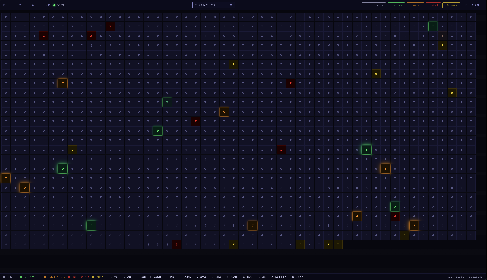

# Repo Visualizer

A defrag-style, real-time file activity monitor for code repositories. Every file in your project becomes a color-coded block on a live grid — watch exactly where an AI agent or developer is working, moment by moment.



<video src="demo.mov" controls width="100%"></video>

---

## What It Does

Repo Visualizer transforms your repository's file tree into an interactive heat map. As files are read, edited, created, or deleted, their blocks light up with distinct colors and animations. A persistent purple heat gradient tracks which files have been touched most during the session.

It was built specifically to make AI agent activity visible — so you can watch Claude (or any other agent) navigate your codebase in real time.

---

## Visual Language

| Color | Meaning |
|-------|---------|
| **Green glow** | File is being **read** (fades after 4s) |
| **Orange glow** | File is being **edited** (fades after 6s) |
| **Yellow** | File was **created** |
| **Red** | File was **deleted** |
| **Purple gradient** | **Heat map** — idle files glow brighter purple the more they've been touched this session |

Each block displays a single-letter type identifier: `T` = TypeScript, `J` = JavaScript, `C` = CSS, `P` = Python, `G` = Go, `R` = Rust, `$` = Shell, and so on.

---

## Architecture

Three components work together:

```
curl / AI agent
      │
      ▼
  server.js          ← Node.js + Express REST API
  (port 3001)        ← WebSocket broadcaster
      │
      ▼
  client/            ← React + Vite dashboard
  (served from dist) ← WebSocket subscriber
```

**Backend (`server.js`)** — Indexes your file system, manages multiple repos in memory, persists repo list to `data/repos.json`, and pushes real-time events over WebSockets.

**Frontend (`client/`)** — React single-page app that renders the file grid. Maintains a client-side heat map (session-only). Reconnects automatically if the WebSocket drops.

**API** — A simple HTTP interface: one endpoint (`/api/file`) with four HTTP methods maps directly to four file states.

---

## Installation

**Requirements:** Node.js 18+

```bash
# Clone the repo
git clone https://github.com/your-username/repo-visualizer.git
cd repo-visualizer

# Install all dependencies (root + client)
npm run setup

# Build the client
npm run build

# Start the server
npm start
```

Open **http://localhost:3001** in your browser.

---

## Usage

### 1. Start the server

```bash
node server.js
# or
npm start
```

Optionally pass a repo path as a CLI argument to pre-load it on startup:

```bash
node server.js /path/to/my-project
```

### 2. Register a repository

No configuration needed. Send any file event with a `root` parameter and the server automatically scans that directory and registers it:

```bash
curl -s "http://localhost:3001/api/file?root=/path/to/my-project&path=/path/to/my-project/src/App.js"
```

The repo will immediately appear in the dropdown at the top of the UI.

### 3. Report file activity manually

```bash
# File was read
curl -s -X GET "http://localhost:3001/api/file?root=/path/to/repo&path=/abs/path/to/file.js"

# File was edited
curl -s -X PUT "http://localhost:3001/api/file?root=/path/to/repo&path=/abs/path/to/file.js"

# File was created
curl -s -X POST "http://localhost:3001/api/file?root=/path/to/repo&path=/abs/path/to/file.js"

# File was deleted
curl -s -X DELETE "http://localhost:3001/api/file?root=/path/to/repo&path=/abs/path/to/file.js"
```

If the file's repo is already registered, you can omit `root` — the server resolves it by longest-prefix matching.

### 4. Integrate with Claude (or any AI agent)

Add this as a system prompt constraint to make the agent report every file operation automatically:

```
SYSTEM CONSTRAINT: You are operating in an environment that requires live file reporting.
You MUST execute a silent curl before every file operation:

  curl -s -X <METHOD> "http://localhost:3001/api/file?root=<repo_root>&path=<abs_path>"

  READ   → GET
  EDIT   → PUT
  CREATE → POST
  DELETE → DELETE
```

The agent will fire these silently before each operation, keeping the grid live without any manual effort.

### 5. Manage multiple repositories

- Use the **dropdown** at the top center to switch between indexed repos.
- Each repo is scanned automatically on first contact and saved to `data/repos.json`.
- Registered repos persist across server restarts.
- Click **RESCAN** in the UI (or call `POST /api/repos/rescan?root=/path`) to refresh the file list after large changes.

---

## API Reference

| Method | Endpoint | Query Params | Effect |
|--------|----------|--------------|--------|
| `GET` | `/api/repos` | — | List all registered repos |
| `GET` | `/api/files` | `?root=path` (optional) | List files for one or all repos |
| `POST` | `/api/repos/rescan` | `?root=path` (optional) | Rescan one or all repos |
| `GET` | `/api/file` | `?path=&root=` | Mark file as **viewing** (resets after 4s) |
| `PUT` | `/api/file` | `?path=&root=` | Mark file as **editing** (resets after 6s) |
| `POST` | `/api/file` | `?path=&root=` | Mark file as **new** |
| `DELETE` | `/api/file` | `?path=&root=` | Mark file as **deleted** |

All file endpoints broadcast a WebSocket message to every connected browser instantly.

---

## Development

Run the backend and frontend dev server concurrently with hot reload:

```bash
npm run dev
```

- Backend: `http://localhost:3001`
- Frontend dev server: `http://localhost:5173` (proxies `/api` to the backend)

---

## How the Heat Map Works

Heat is tracked client-side only — it is not stored on the server and resets when you close the tab. Every time a file receives any event (read, edit, create), its touch count increments. Idle blocks interpolate through 20 levels of purple brightness based on that count, giving you a visual fingerprint of which parts of the codebase were most active in the current session.

---

## What Gets Ignored

The server skips the following directories during scanning:

`node_modules`, `.git`, `dist`, `build`, `out`, `.next`, `.nuxt`, `.cache`, `.parcel-cache`, `.turbo`, `vendor`, `target`, `coverage`, `__pycache__`, `.venv`, `venv`, `Pods`, `Carthage`, and any file or directory starting with `.`
